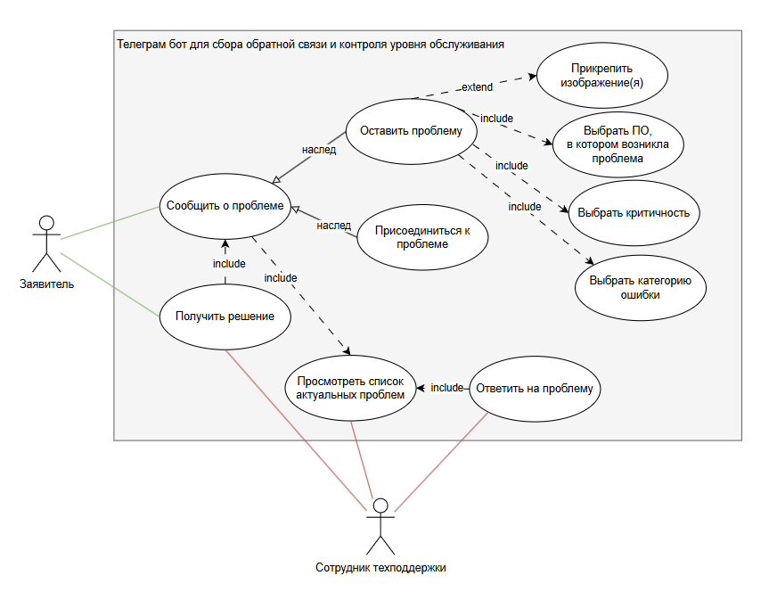

#### Документация к проекту "Телеграм-бот для сбора обратной связи и контроля уровня обслуживания"

##### Схема использования системы пользователями:

##### Use cases:

##### Общая архитектура:

##### Взаимодействие модулей и коннекторов (API):

##### Создание клавиатуры:

##### Нажатие на кнопку:

##### Создание запроса:

##### Прикрепление изображения:
