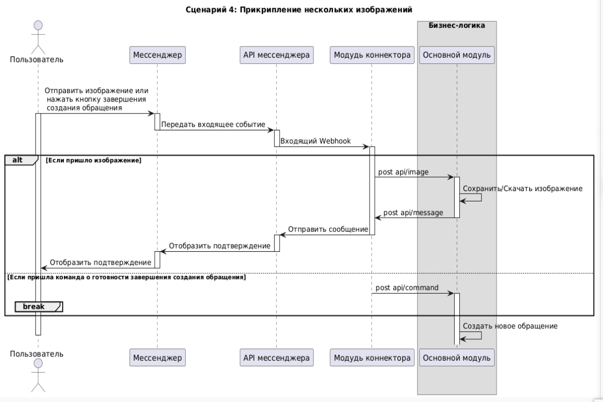

#### Документация к проекту "Телеграм-бот для сбора обратной связи и контроля уровня обслуживания"

##### Общая архитектура:

##### Взаимодействие модулей и коннекторов

##### Создание клавиатуры:

##### Нажатие на кнопку:

##### Создание обращения:

##### Добавление фото:

