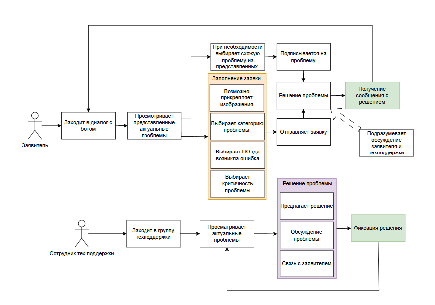
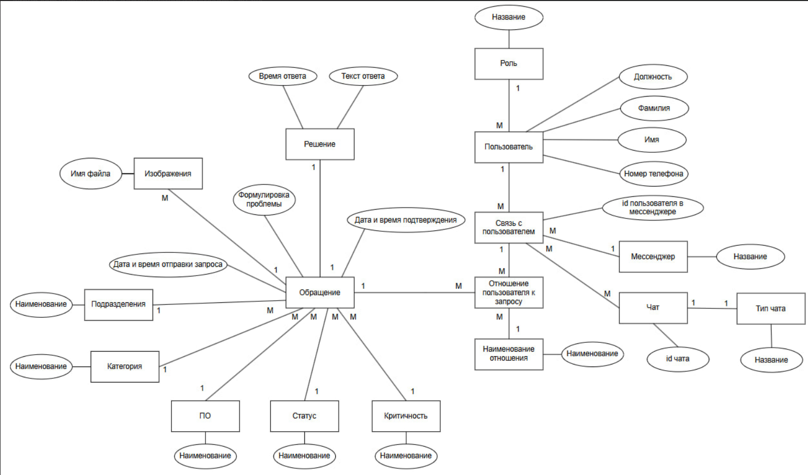
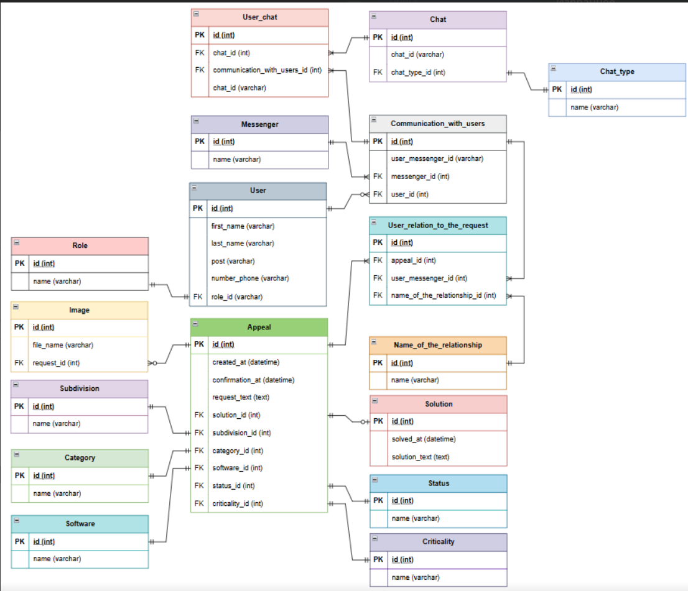

#### Документация к проекту "Телеграм-бот для сбора обратной связи и контроля уровня обслуживания"
##### Цель проекта:
Создание и внедрение удобного, простого и эффективного инструмента для сбора и обработки обратной связи от пользователей (механиков и сервисных консультантов) системы «Умный Гараж» (УмГар). Проект направлен на сокращение времени реакции на проблемы и повышение качества обратной связи.

##### Схема использования системы пользователями:

##### Use cases:

##### Общая архитектура:

##### Взаимодействие модулей и коннекторов (API):

##### Создание клавиатуры:

##### Нажатие на кнопку:

##### Создание запроса:

##### Прикрепление изображения:

##### Словарь предметной области
| №                                           | Сущность                         | Английский эквивалент          | Описание                                                                                                                                      |
| ------------------------------------------- | -------------------------------- | ------------------------------ | --------------------------------------------------------------------------------------------------------------------------------------------- |
| I. Основные Бизнес-Сущности                 |                                  |                                |                                                                                                                                               |
| 1                                           | Обращение                        | (Appeal)                       | Тикет или Запрос от пользователя, требующий решения и прохождения жизненного цикла в системе.                                                 |
| 2                                           | Решение                          | (Solution)                     | Детальное описание действий, предпринятых для устранения проблемы по обращению, включая финальный результат и закрытие.                       |
| 3                                           | Пользователь                     | (User)                         | Лицо, создавшее обращение (Инициатор) или вовлеченное в его обработку.                                                                        |
| 4                                           | Изображения                      | (Image)                        | Прикрепленные файлы (скриншоты, фотографии), которые помогают лучше понять и документировать проблему пользователя.                           |
| 5                                           | Текст обращения                  | (Text_of_the_appeal)           | Основное текстовое описание проблемы, предоставленное пользователем.                                                                          |
| II. Классификация и Статусы                 |                                  |                                |                                                                                                                                               |
| 6                                           | Статус                           | (Status)                       | Текущее состояние запроса в процессе работы (например, "Новый", "В работе", "Закрыт").                                                        |
| 7                                           | Категория                        | (Category)                     | Классификационная группа, определяющая предметную область проблемы (например, "Техническая поддержка", "Сбой").                               |
| 8                                           | ПО                               | (Software)                     | Программное обеспечение, с которым связана возникшая проблема.                                                                                |
| 9                                           | Критичность                      | (Criticality)                  | Степень влияния проблемы на работу или бизнес-процессы, определяющая уровень приоритета.                                                      |
| 10                                          | Подразделение                    | (Subdivision)                  | Организационный отдел или департамент, ответственный за обработку или маршрутизацию обращения.                                                |
| III. Роли и Отношения                       |                                  |                                |                                                                                                                                               |
| 11                                          | Роль                             | (Role)                         | Назначенная функция или уровень доступа Пользователя в системе (например, "Администратор", "Клиент").                                         |
| 12                                          | Отношение пользователя к запросу | (User_relation_to_the_request) | Сущность, описывающая, какую конкретную роль Пользователь занимает в данном Обращении (связующая таблица).                                    |
| 13                                          | Наименование отношения           | (Name_of_the_relationship)     | Тип роли Пользователя по отношению к конкретному запросу (например, "Ответственный", "Наблюдатель", "Исполнитель").                           |
| IV. Технические и Коммуникационные Элементы |                                  |                                |                                                                                                                                               |
| 14                                          | API мессенджера                  | (Messenger API)                | Внешний интерфейс, предоставляемый платформой (Telegram), который позволяет Модулю коннектора принимать входящие события и отправлять ответы. |
| 15                                          | Мессенджер                       | (Messenger)                    | Канал связи или платформа, через которую Пользователь взаимодействует с системой.                                                             |
| 16                                          | Связь с пользователем            | (Communication_with_users)     | Связующая запись, хранящая уникальный идентификатор Пользователя в конкретном Мессенджере (для маршрутизации ответов).                        |
| 17                                          | Команда                          | (Command)                      | Сообщение от пользователя (обычно начинается с /) или нажатие кнопки, которое вызывает определенный сценарий или функцию в системе.           |
| 18                                          | Клавиатура                       | (Keyboard)                     | Набор интерактивных кнопок, отображаемых в интерфейсе Мессенджера для упрощения ввода команд и выбора параметров.                             |
| 19                                          | Кнопка                           | (Button)                       | Интерактивный элемент Клавиатуры, при нажатии которого генерируется событие для системы.                                                      |
| 20                                          | Личные сообщения                 | (Personal_messages)            | Прямая коммуникация с одним Пользователем в режиме "один на один".                                                                            |
| 21                                          | Группа                           | (Group)                        | Групповой чат в Мессенджере, который может использоваться для обсуждения Обращения множеством пользователей.                                  |
| 22                                          | Присоединение к проблеме         | (Joining_the_problem)          | Действие, позволяющее другому Пользователю (сотруднику или клиенту со схожей проблемой) получить доступ к Обращению и стать его наблюдателем. |
| V. Архитектурные Модули                     |                                  |                                |                                                                                                                                               |
| 23                                          | Основной модуль                  | (Main_module)                  | Центральный компонент системы, содержащий всю основную бизнес-логику для обработки, сохранения и управления Обращениями.                      |
| 24                                          | Модуль коннектора                | (Connector_module)             | Технический компонент, отвечающий за прием, перевод и отправку сообщений между API мессенджера и Основным модулем системы.                    |
| 25                                          | Модуль конечного автомата        | (Finite_state_machine_module)  | Технический компонент, отвечающий за управление переходами Обращения между различными Статусами, обеспечивая корректный жизненный цикл.       |

##### Модели данных

